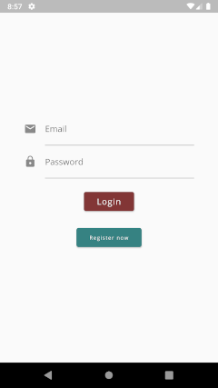
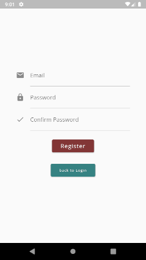
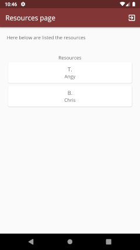

# JWTAuthApp
Client App for managing JSON web tokens for secure applications.

# Description
This Flutter Application is the basic example of an App that requires authentication through the JWT protocol: it allows anyone to register and any connected user can access a piece of data. I have implemented the back-end with Node (see jwt-auth-api project). In particular, the access token mechanism is used in combination with the refresh token: the access token is a temporary token that is used to access resources. The refresh token is a token that lasts for the log-in session and is used when another one needs to be generated when the access token expires.

Questa Applicazione Flutter è l'esempio base di un'App che richiede l'autenticazione attraverso il protocollo JWT : consente a chiunque di registrarsi e qualsiasi utente connesso può accedere a una parte di dati. Ho implementato il back-end con Node (vedi progetto jwt-auth-api). In particolare si utilizza il meccanismo del token di accesso in combinazione con il token di refresh: il token di accesso è un token temporaneo che viene utilizzato per l'accesso alle risorse. Il token di refresh è un token che dura per la sessione di log-in e che viene usato quando alla scadenza del token di accesso è necessario generarne un'altro. 

## Built With

*   [http](https://pub.dev/packages/http) A composable, Future-based library for making HTTP requests.
*   [flutter_session](https://pub.dev/packages/flutter_session) Adds session support to Flutter.
*   [flutter_bloc](https://pub.dev/packages/flutter_bloc) Flutter Widgets that make it easy to implement the BLoC (Business Logic Component) design pattern.
*   [rxdart](https://pub.dev/packages/rxdart) RxDart adds additional capabilities to Dart Streams and StreamControllers.
*   [equatable](https://pub.dev/packages/equatable) An abstract class that helps to implement equality without needing to explicitly override == and hashCode.
*   [localstorage](https://pub.dev/packages/localstorage) Simple json file-based storage for flutter.

## Business Logic Components
My approach was to use the BLoC pattern to simplify authentication and navigation management operations: The BLoC pattern manages sinks and exposes streams, adopting the logic of message passing (or event driven). I have defined a BLoC for each context of the application: Authentication and data retrieval with the restful API and navigation between the login, register and resources screens:
* [AuthBLoC](lib/blocs/auth/auth_bloc.dart).
* [LoginBLoC](lib/blocs/login/login_bloc.dart).
* [RegisterBLoC](lib/blocs/register/register_bloc.dart).
* [ResourceBLoC](lib/blocs/resources/resource_bloc.dart).

## Screens

